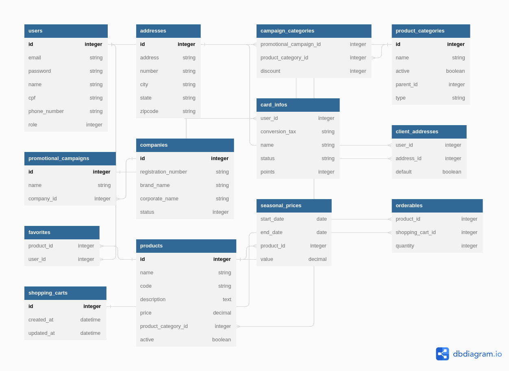

<h1 align="center"> Loja do Clube de Compras :convenience_store:</h1>

## :memo: Descrição
A App 'Loja do Clube' é parte do Clube de Compras, projeto final da turma 10 do TreinaDev, Campus Code. Trata-se de desenvolver, em grupo, uma aplicação web em Ruby on Rails, com a metodologia de Desenvolvimento Guiado por Testes (TDD).

A aplicação oferece aos funcionários das empresas cadastradas a possibilidade de adquirir produtos, por meio de um cartão carregado com pontos. Estes usuários tem a possibilidade de aproveitar promoções e descontos oferecidos pelas suas respectivas empresas.

## :technologist: Time:

  - Clauf
  - Eduardo Celino
  - Felipe Silva
  - Luan
  - Matheus Barros
  - Mattheus Ferreira
  - Ricardo
  - Tereza

## :books: Funcionalidades principais

  - Cadastro de venda de produtos;
  - Separação de produtos por categorias;
  - Criação de campanhas promocionais para empresas cadastradas no sistema, através de outra app,
    cuja API é consumida, trazendo dados das empresas;
  - Criação de preços sazonais para produtos específicos;

## :wrench: Tecnologias utilizadas
* Rails 7.0.5
* Ruby 3.1.2
* Devise 4.9.2
* Rspec-rails 6.0.3
* Capybara 3.39.1
* SQLite3 1.6.3 (x86_64-linux)
* Bootstrap (5.3.0);

## :rocket: Rodando o projeto
No terminal, clonar o projeto:
```
git clone git@github.com:TreinaDev/LojaClubeTD10.git
```

Na pasta da aplicação, rode o comando:
```

* bin/setup
* yarn install
```

Executar o servidor Rails:
```
* bin/dev
```

Abra o navegador com do endereço:
```
http://localhost:5000
```

Rodar os testes:
```
rspec
```

## :computer: Banco de dados

A estrutura do banco de dados possui a seguinte estrutura:

