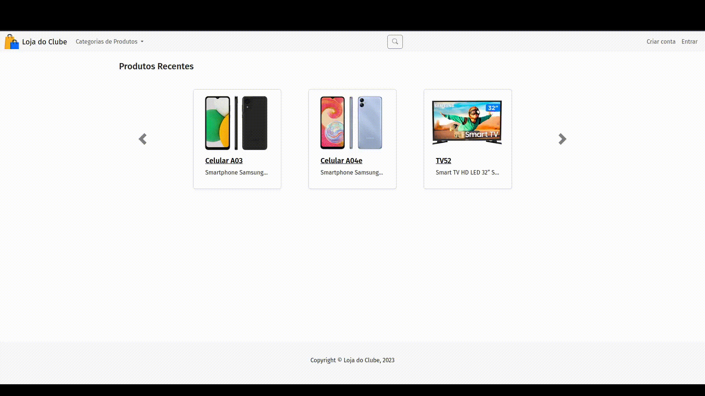

<h1 align="center">Loja do Clube de Compras :convenience_store:</h1>

<div align="center">


</div >

<br />

## :memo: Descrição do Projeto

A App 'Loja do Clube' é parte do Clube de Compras, projeto final da turma 10 do TreinaDev, Campus Code. Trata-se de desenvolver, em grupo, uma aplicação web em Ruby on Rails, com a metodologia de Desenvolvimento Guiado por Testes (TDD).

A aplicação oferece aos funcionários das empresas cadastradas a possibilidade de adquirir produtos, por meio de um cartão carregado com pontos. Estes usuários tem a possibilidade de aproveitar promoções e descontos oferecidos pelas suas respectivas empresas.

Esta é a segunda aplicação do projeto Clube de Compras que envolve mais 2 aplicações integradas [Gestão de Empresas](https://github.com/TreinaDev/GestaoEmpresasTD10) e [Cartões e Pagamentos](https://github.com/TreinaDev/CartoesEPagamentosTD10), por isso certifique-se de que tenha os 3 projetos rodando, para total funcionamento da aplicação do projeto Clube de Compras.

<br />

## :technologist: Time:

- [](https://github.com/ClaufSS)
- [](https://github.com/ehcelino)
- [](https://github.com/felipel7)
- [](https://github.com/tbkanzaki)
- [](https://github.com/MatheusOB21)
- [](https://github.com/MatFerreira)
- [](https://github.com/Ricardonovais1)
- [](https://github.com/tbkanzaki)

<br />

## :books: Funcionalidades principais

### Cadastro de usuários

- A aplicação possui dois perfis de usuário:

  - **Administradores**: devem ter e-mail com domínio punti.com, e são responsáveis pelos cadastros básicos da aplicação, como cadastro de categorias de produtos, produtos que estarão disponíveis na loja, pela gestão das campanhas e preços sazonais.

  - **Usuários comuns**: qualquer pessoa pode criar uma conta na plataforma, porém apenas os que possuem o CPF ativo na Gestão de Empresas poderão registrar pedidos. No momento em que o funcionário é bloqueado ou demitido ele deixa de possuir esse benefício.

### Página Inicial

- Os visitantes e usuários comuns conseguem visualizar os produtos recém adicionados na loja, filtrar produtos por categorias e fazer buscas por produtos.

### Cadastro de Categorias e Subcategorias de Produtos

- Um administrador pode cadastrar, editar, desativar e reativar Categorias e Subcategorias do produto

### Cadastro de Produtos

- Um administrador pode cadastrar, editar, desativar e reativar um único produto ou fazer uma busca e desativar e reativar esse grupo de produtos retornados da busca. No cadastro e edição do produto, pode-se fazer upload de várias imagens.

### Campanhas Promocionais

- O administrador pode cadastrar campanhas promocionais para as empresas parceiras por um determinado período e pode escolher descontos para uma ou mais categorias.

### Preços Sazonais

- O administrador pode cadastrar preços sazonais para determinados produtos por um determinado período.

### Carrinho de Compras

- O usuário pode adicionar/remover produtos no carrinho de compras.

### Fazer pedido

- O usuário pode concluir a compra finalizando um pedido.

### Área do Cliente

- Minha Conta
- Meus Pedidos
- Meus Endereços
- Meu Extrato
- Minhas Informações
- Meus Favoritos

<br />

## :wrench: Tecnologias

- Rails 7.0.5
- Ruby 3.1.2
- Devise 4.9.2
- Rspec-rails 6.0.3
- Capybara 3.39.1
- SQLite3 1.6.3 (x86_64-linux)
- Bootstrap (5.3.0);

<br />

## :rocket: Rodando o projeto

No terminal, clonar o projeto:

```
git clone git@github.com:TreinaDev/LojaClubeTD10.git
```

Para clonar as outras aplicações:

```
git clone https://github.com/TreinaDev/GestaoEmpresasTD10.git
```

```
git clone https://github.com/TreinaDev/CartoesEPagamentosTD10
```

Observação: A aplicação de Gestão de Empresas irá rodar na porta **3000** e a de Cartões e Pagamento na porta **4000**

<br />

Na pasta da aplicação, rode o comando:

```bash
bin/setup
```

```bash
yarn install
```

```bash
rails db:reset
```

Executar o servidor Rails:

```bash
bin/dev
```

Abra o navegador com do endereço:

```
http://localhost:5000
```

Usuários:

| E-mail               | Senha     | Tipo          |
| -------------------- | --------- | ------------- |
| `admin@punti.com`    | senha1234 | Administrador |
| `joana@provedor.com` | senha1234 | Usuário comum |
| `maria@provedor.com` | senha1234 | Usuário comum |

<br />

Rodar os testes:

```
rspec
```

<br />

## :computer: Banco de dados

A estrutura do banco de dados possui a seguinte estrutura:


## Página Inicial


## Detalhes do Produto


## Campanha de Empresas


## Carrinho de Compras


## Finalizar Pedido


## Área do Cliente


## Favoritos


## Compra de um produto

